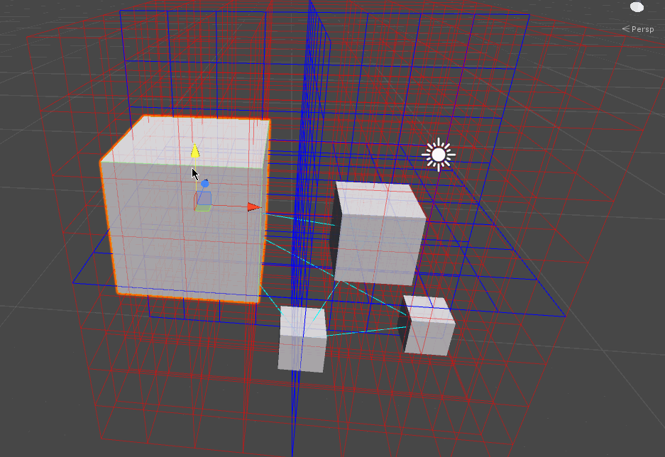

# MortonOrder

This is a sample project for presenting MortonOrder.  
You can see [commentary article for morton order](http://edom18.hateblo.jp/entry/2017/07/28/083153). (This article has been written in Japanese)

---------

このサンプルプロジェクトはモートンオーダーを実装したものになります。  
Qiitaに解説記事（[八分木（モートンオーダー）を使ってエリアを分割して処理負荷を軽減する](http://edom18.hateblo.jp/entry/2017/07/28/083153)）を書いているので、興味がある方は参照ください。

